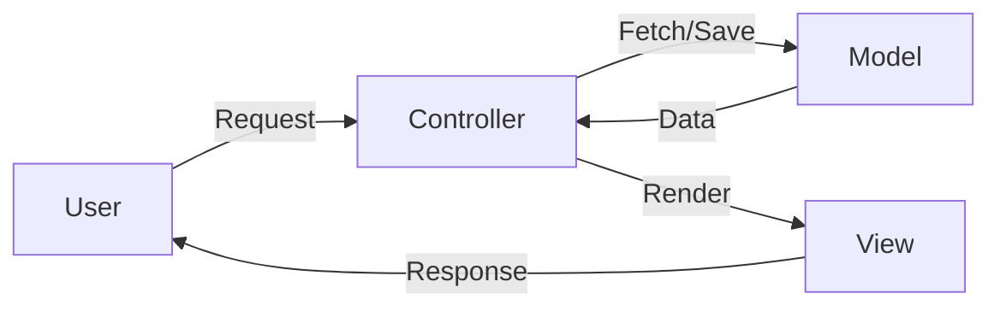

# Day 5: MVC Architecture

MVC stands for **Model-View-Controller**. It is a software architectural pattern commonly used for developing user interfaces that divides an application into three interconnected parts. This is done to separate internal representations of information from the ways information is presented to and accepted from the user.

---

## 🏗️ The Three Components

### 1. Model (Data)
The **Model** represents the data and the logic of the application. It's responsible for managing the data of the application. It receives user input from the controller.
- **Responsibility**: Database communication, data validation, and business logic.
- **Example**: A `Product` model that defines what a product looks like (title, price, description) and interacts with the database.

### 2. View (User Interface)
The **View** is what the user sees. It renders the data from the model into a form suitable for interaction.
- **Responsibility**: Presentation layer, HTML, CSS, and UI components.
- **Example**: An EJS or Pug template that displays a list of products to the user.

### 3. Controller (Logic)
The **Controller** acts as an interface between Model and View components to process all the business logic and incoming requests, manipulate data using the Model component, and interact with the Views to render the final output.
- **Responsibility**: Handling HTTP requests, routing logic, and coordinating between Model and View.
- **Example**: A function that fetches all products from the Model and passes them to the View to be displayed.

---

## 🔄 The MVC Flow



1. **User** interacts with the **View** (e.g., clicks a button).
2. **Controller** receives the request.
3. **Controller** asks the **Model** for data or updates the data.
4. **Model** processes the logic and returns data to the **Controller**.
5. **Controller** sends the data to the **View**.
6. **View** renders the final page and sends it back to the **User**.

---

## 🌟 Why use MVC?

- **Separation of Concerns**: Each part has a specific job, making the code cleaner.
- **Maintainability**: Easier to update or swap parts (e.g., changing the database won't affect the UI logic).
- **Scalability**: Multiple developers can work on different parts (Model, View, or Controller) simultaneously.
- **Testability**: Components can be tested independently.

---

## 📂 Folder Structure

In a typical Node.js/Express application, the MVC structure looks like this:

```text
/ Day 5
  / controllers
    - products.js (Logic for product requests)
    - error.js    (Logic for 404 errors)
  / models
    - product.js  (Data object with JSON file persistence)
  / data
    - products.json (Storage file for product data)
  / routes
    - admin.js    (Route definitions for admin)
    - shop.js     (Route definitions for shop)
  / views
    - shop.ejs, add-product.ejs, 404.ejs
  - app.js (Main entry point)

```

## 🛠️ Implementation Steps

1. **Move Controllers**: Extracted logic from `routes` into `controllers/`. Created `products.js` for main logic and `error.js` for 404 handling.
2. **Define Models**: Implemented a `Product` class in `models/product.js` that uses the `fs` module to store data in a JSON file (`/data/products.json`).
3. **Handle Asynchronicity**: Updated model and controller methods to use **callbacks** to ensure data is correctly fetched before rendering views.
4. **Link Routes**: Updated routes to use exported controller actions, making the routing files extremely lightweight.


